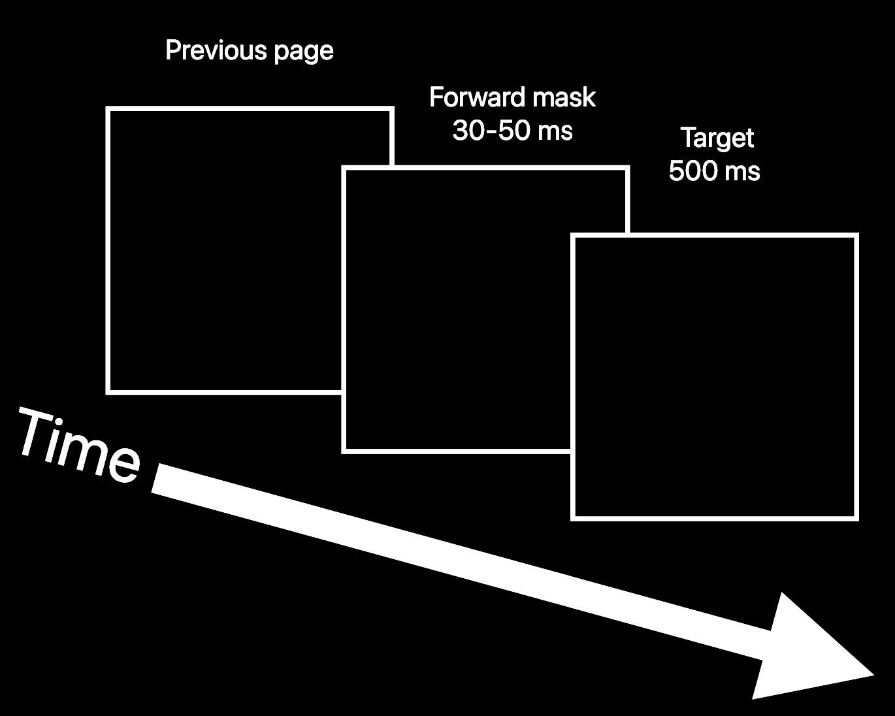

# Psychorama - Subliminal Forward Masking for Enhanced User Engagement

Psychorama is a JavaScript-based proof-of-concept that leverages the power of subliminal messaging through [forward masking](https://en.wikipedia.org/wiki/Visual_masking). By subtly influencing user perception, it primes users to be more receptive to specific keywords or messages within a web page. This technique is not only intriguing from a psychological perspective but also has practical applications in marketing and user engagement strategies.

## Table of Contents

- [Overview](#overview)
- [Installation](#installation)
- [Usage](#usage)
- [Business Use Case](#business-use-case)
- [Contributing](#contributing)
- [License](#license)

## Overview

Forward masking, as used in Psychorama, involves replacing non-essential words in the content with masking terms of the same character count, making it a powerful tool for subliminal messaging. This subtle manipulation can influence user behavior, attention, and perception, making it valuable for a range of applications, including marketing and user experience optimization.



## Installation

1. Clone the Psychorama repository to your local machine:

   ```bash
   git clone https://github.com/psibir/psychorama.git
   ```

2. Navigate to the project directory:

   ```bash
   cd psychorama
   ```

3. Open `index.html` in your preferred web browser.

## Usage

Psychorama is designed to be easy to use and integrate into existing web projects. To implement the forward masking effect with your own content, follow these steps:

1. Include the necessary HTML structure in your webpage.

   ```html
   <div class="product-title">Product Title</div>
   <div class="product-description">Product Description</div>
   ```

2. Prepare your masking terms and secured keywords in CSV files, as described in the project structure.

3. Customize the JavaScript code in `script.js` to target the elements where you want to apply the masking effect and specify the paths to your CSV files.

4. Run your website or web application, and Psychorama will automatically apply the forward masking effect to non-essential words.

## Business Use Case

Psychorama has several potential applications in the business world, particularly in marketing and user engagement strategies:

### 1. Enhanced Advertising Campaigns

By subtly influencing user perception, Psychorama can be used to make users more receptive to specific keywords or messages in advertising content. This can lead to increased brand recall and user engagement.

### 2. Conversion Rate Optimization

Incorporating forward masking in landing pages or product descriptions can focus users' attention on essential information, such as key product features or benefits, potentially improving conversion rates.

### 3. User Experience Enhancement

Psychorama can be applied to user interfaces to draw attention to important interface elements or guide users through a specific user flow, enhancing the overall user experience.

### 4. A/B Testing and Optimization

Marketers and web developers can use Psychorama for A/B testing and optimization, comparing the effectiveness of different forward masking strategies in achieving specific business goals.

### 5. Subliminal Messaging Research

Psychorama can also be a valuable tool for academic and psychological research on subliminal messaging and user perception.

By utilizing Psychorama's subliminal forward masking technique, businesses can unlock new possibilities for engaging users and driving desired user behaviors.

## Contributing

We welcome contributions from the open-source community. If you'd like to contribute to Psychorama or report issues, please check our [contribution guidelines](CONTRIBUTING.md).

## License

Psychorama is open-source and available under the [MIT License](LICENSE). You are free to use, modify, and distribute this software for both personal and commercial purposes.

**Note:** Psychorama should be used responsibly and ethically. Subliminal messaging should not be used to deceive or manipulate users against their will.

For any questions or concerns, please contact the project maintainers.

---

**Disclaimer:** Psychorama is an experimental project designed for educational and research purposes. The effectiveness of subliminal messaging and forward masking may vary, and its use should comply with applicable laws and ethical standards.
